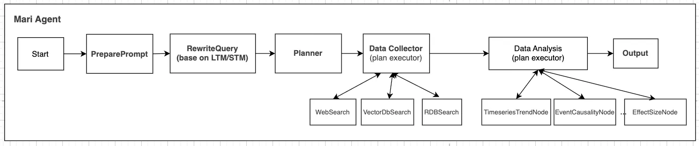

# Mari Agent 🤖


**에너지·원자재 시장 데이터 분석 및 자동화 에이전트 프레임워크**

## 📖 소개

`Mari Agent`는 에너지 및 원자재 시장의 데이터 수집, 분석, 인사이트 추출을 자동화하는 LangGraph 기반 AI 에이전트 패키지입니다. LNG, 원유, 가스 등 주요 에너지 상품의 시장 데이터를 다양한 소스에서 통합적으로 수집하고 분석하여 고품질 인사이트를 제공합니다.

### 주요 특징

- **멀티소스 통합**: RDB, Web, VectorDB 등 이종 데이터 소스 통합 관리
- **도메인 특화**: 에너지·원자재 시장 전문 용어 및 분석 모델 내장
- **워크플로우 자동화**: 쿼리 분석부터 최종 결과 출력까지 End-to-End 파이프라인
- **React 패턴 지원**: 에이전트의 Thought-Action-Observation 기반 의사결정
- **확장성**: 모듈식 구조로 새로운 데이터 소스 및 분석 노드 쉽게 추가 가능
- **컨테이너화**: Docker 기반 배포 지원으로 일관된 환경 보장
- **프롬프트 캐싱**: 1시간 주기 캐싱으로 성능 최적화

## 🚀 주요 기능

- **쿼리 분석 및 최적화**: 자연어 질의를 구조화된 검색 계획으로 변환
- **플랜 기반 데이터 수집**: 최적의 데이터 소스 조합으로 효율적 정보 수집
- **관계형 데이터베이스(RDB) 지원**: 시계열 데이터, 가격 정보, 스프레드 등 수치 분석
- **벡터 데이터베이스 검색**: 임베딩 기반 유사도 검색으로 보고서 및 문서 분석
- **웹 데이터 통합**: 뉴스 및 이벤트 정보의 실시간 수집 및 분석 (Tavily API 지원)
- **시계열/이벤트 분석**: 트렌드 분석, 이벤트 효과 측정, 인과관계 추론
- **동적 결과 포매팅**: 사용자 친화적인 결과 포맷 자동 생성
- **MCP 프로토콜 지원**: Model Context Protocol을 통한 외부 도구 연동
- **지능형 프롬프트 관리**: 로컬/MCP 프롬프트 자동 Fallback 및 캐싱

## 🛠️ 시스템 아키텍처



### 워크플로우 노드

| 노드 | 설명 | 개선사항 |
|------|------|----------|
| **PrepareAxPromptNode** | A.X Platform 연동으로 프롬프트 외부화 및 버전 관리 | 캐싱 시스템 적용 |
| **RewriteQueryNode** | 질의 컨텍스트 통합, 도메인 정규화, 복합 질의 분해 | 맥락별 기간 해석 개선 |
| **PlannerNode** | 데이터 수집 및 분석 실행 계획 최적화 수립 | - |
| **DataCollectNode** | 다양한 소스에서 데이터 수집 및 충분성 평가 | - |
| **DataAnalysisNode** | 수집 데이터 기반 인사이트 도출 및 패턴 분석 | 프롬프트 태그 시스템 적용 |

### 데이터 수집 도구 (Tool Nodes)

- **WebSearchNode**: 웹 뉴스/이벤트 등 비정형 데이터 검색 (Tavily API 통합)
- **RdbSearchNode**: 관계형 데이터베이스(RDB) 기반 구조화 데이터 검색
- **VectorSearchNode**: 임베딩 기반 벡터 유사도 검색

### 데이터 분석 도구 (Tool Nodes)

- **TimeseriesTrendNode**: 시계열 데이터 트렌드 및 이상치 분석
- **EventCausalityNode**: 이벤트-데이터 변동 원인-결과 분석
- **EffectSizeNode**: Pre/Post 윈도우 기반 효과 크기 분석

## 📂 폴더 구조

```
graph.yaml                    # 전체 파이프라인 그래프 정의
pyproject.toml                # 프로젝트 메타/의존성 관리
uv.lock                       # uv 패키지 잠금 파일
mari_agent/
├── graph_builder.py          # 전체 파이프라인 그래프 빌더
├── common/                   # 공통 타입, 스키마, 유틸리티
│   ├── config.py             # 환경설정 및 공통 설정 관리
│   ├── mcp.py                # MCP 연동 관련 코드
│   ├── tracer_for_sdk.py     # Phoenix/SDK 트레이싱 유틸
│   ├── utils.py              # 공통 유틸리티 함수
│   └── types/                # Pydantic 모델 및 스키마
│       ├── nodes.py
│       └── schemas.py
├── graph/                    # 파이프라인 노드, 워크플로우
│   ├── llms.py               # LLM 클라이언트 및 모델 관리
│   ├── states.py             # MariGraphState 정의
│   ├── tools/                # 데이터 수집/분석 도구 및 ToolManager
│   │   ├── data_analysis/    # 분석 도구 (예: similarity.py)
│   │   ├── data_collect/     # 수집 도구 (예: rdb_search.py, vector_search.py, web_search.py)
│   │   ├── tool_manager.py   # ToolManager 및 도구 관리
│   ├── nodes/                # 워크플로우 노드 구현
│   │   └── workflow_nodes.py
│   └── prompts/              # 프롬프트 템플릿 (계층 구조)
│       ├── DataAnalysisNode/
│       │   ├── default.py    # 공통 프롬프트
│       │   └── sk_energy.py  # 에너지 섹터 특화 프롬프트
│       ├── DataCollectNode/
│       │   ├── default.py    # 공통 프롬프트
│       ├── PlannerNode/
│       │   ├── default.py    # 공통 프롬프트
│       ├── RewriteQueryNode/
│       │   └── default.py    # 공통 프롬프트
│       ├── WebSearch/
│       │   └── default.py    # 공통 프롬프트
│       └── prompt_manager.py # 프롬프트 빌더 및 메시지 생성 (캐싱 시스템 포함)
├── static/                   # 정적 리소스
│   ├── drawio/               # 다이어그램
│   └── image/                # 이미지 리소스
└── test/                     # 테스트 코드
    ├── test_prompt_loader.py # 프롬프트 로더 테스트
    └── sample_data/          # 테스트용 샘플 데이터
```

## 🔧 설치 방법

이 프로젝트는 `uv`를 사용하여 의존성을 관리합니다:

```bash
# uv 설치 (필요한 경우)
curl -sSf https://install.python-uv.org/installer.py | python3

# 저장소 클론
git clone https://gitlab.tde.sktelecom.com/AIPG/consolidated/ai-platform/custom/agent/mi_agents.git
cd mi_agents

# 의존성 설치
uv sync
```

## ⚙️ 환경 설정

`.env` 파일에 필요한 환경 변수를 설정합니다:

```bash
# LLM 관련 설정
LLM_API_KEY=your_llm_api_key
LLM_ENDPOINT=https://your-llm-endpoint
LLM_MODEL_GPT_4o=your_model_name
LLM_MODEL_GPT_4_1=your_model_name

# Web Search 설정
TAVILY_API_KEY=your_tavily_api_key
TAVILY_SCORE_THRESHOLD='>=0.6 이상 권고'
TAVILY_MAX_CONCURRENT_REQUESTS=15

# MCP 서버 설정 (선택사항)
AX_MCP_SERVER_URL=http://127.0.0.1:8080/mcp
AX_MCP_SERVER_API_KEY=your_mcp_api_key
AX_MCP_PROMPT_ENABLED=true  # MCP 프롬프트 사용 여부
AX_MCP_PROMPT_MARI_TAG_GROUP=mari_agent  # 프롬프트 태그 그룹

# Phoenix Tracing 설정 (선택사항)
PHOENIX_TRACER__ENABLED=false
LANGCHAIN_TRACING_V2=false
```

## 🚀 실행 방법

### 1. 로컬 개발 환경

```bash
# 테스트 실행
uv run pytest test/test_mari_agent.py -v

# 직접 실행
uv run python -c "
import asyncio
from mari_agent.graph_builder import builder

async def main():
    result = await builder.ainvoke({
        'query': '어제의 WTI 가격을 알려줘',
        'thread_id': 'test-001'
    })
    print(result)

asyncio.run(main())
"
```

### 2. Docker 컨테이너 실행

```bash
# build image
docker build --platform linux/amd64 -t aip-harbor.sktai.io/sktai/custom/agent/mari_agent:v0.0.1 -f ./sktaip.Dockerfile .

# (optional) docker 버전에 따라 oci로 빌드 된경우, docker type 변경 필요
docker buildx build --output type=docker,name=aip-harbor.sktai.io/sktai/custom/agent/mari_agent:v0.0.1 --platform linux/amd64 -t aip-harbor.sktai.io/sktai/custom/agent/mari_agent:v0.0.1 -f ./sktaip.Dockerfile .

# push
docker push --platform linux/amd64 aip-harbor.sktai.io/sktai/custom/agent/mari_agent:v0.0.1

# (for local test) container run 
docker run -d --platform linux/amd64 -p 18080:18080 --name mari_agent aip-harbor.sktai.io/sktai/custom/agent/mari_agent:v0.0.1
```

### 3. ADXP 플랫폼 배포

```bash
# ADXP CLI를 통한 배포
adxp-cli agent deploy --image aip-harbor.sktai.io/sktai/custom/agent/mari_agent:v0.0.1 --name mari_agent --description mi_project --env-path ./.env --no-external-registry
```

## 🔍 특화 기능

### 지능형 프롬프트 관리

- **계층 구조 지원**: 노드별/태그별 프롬프트 세분화
- **자동 Fallback**: MCP → 로컬 프롬프트 자동 전환
- **캐싱 시스템**: 1시간 주기 캐시로 성능 최적화
- **태그 기반 탐색**: 유연한 프롬프트 경로 탐색

```python
# 프롬프트 태그 예시
tags = ["DataAnalysisNode", "sk_energy"]  
# → mari_agent.graph.prompts.DataAnalysisNode.sk_energy

tags = ["DataAnalysisNode", "sk_energy", "oil_price_analysis"]
# → mari_agent.graph.prompts.DataAnalysisNode.sk_energy__oil_price_analysis
```

### 도메인 정규화

에너지/원자재 도메인 특화 정규화 기능:

- **맥락별 기간 해석**: 상대적 시간 표현을 절대 타임스탬프로 변환
  - "최근 가격" → 1개월 (30일)
  - "최근 동향" → 3개월 (90일)
- **상품 표준화**: 원유(Brent, WTI), 가스(Henry Hub), LNG(JKM) 등 표준 명칭 처리
- **단위 변환**: 다양한 에너지 단위(USD/bbl, USD/MMBtu) 자동 변환

### 데이터 검증 프레임워크

수집 데이터에 대한 체계적 검증:

- **전역 정합성**: 시간축, 빈도, 단위, 스키마의 일관성 검증
- **충분성 평가**: 행 수, 결측률, 데이터 범위 등에 대한 불리언 표현식 기반 평가
- **보강 전략**: 충분성 미달 시 기간 확장, 쿼리 구체화, 필터 완화 등 자동 적용

## 💡 사용법

### 1. API 서버 호출

```python
import asyncio
from langserve import RemoteRunnable

async def query_agent():
    # API 인증 헤더 설정
    headers = {
        "aip-user": "mi_test_user",
        "Authorization": "Your-AIP-Key-Here",
    }
    
    # 질의 예시
    query = "Brent유 1개월물의 최근 가격 알려줘"
    input_data = {
        "query": query,
        "thread_id": "test-thread-001",
    }

    # 에이전트에 요청 전송
    agent = RemoteRunnable("http://localhost:18080", headers=headers)
    response = await agent.ainvoke(input=input_data)
    
    return response

# 실행
result = asyncio.run(query_agent())
print(result)
```

### 2. 로컬 직접 사용

```python
import asyncio
from mari_agent.graph_builder import builder

async def run_local_query():
    # 질의 예시
    query = "WTI의 최근 동향을 분석해줘"  # → 3개월 기간으로 해석
    input_data = {
        "query": query,
        "thread_id": "local-test-001",
    }
    
    # 에이전트 실행
    result = await builder.ainvoke(input_data)
    return result

# 실행
result = asyncio.run(run_local_query())
print(result)
```

### 3. 질의 예시

```python
# 다양한 질의 예시
queries = [
    "Brent유 1개월물의 최근 가격 알려줘",      # → 1개월 기간
    "WTI의 최근 동향을 분석해줘",              # → 3개월 기간  
    "Henry Hub의 최근 1주일 변동성은?",       # → 1주일 기간
    "최근 3개월간 LNG 가격 트렌드",            # → 3개월 기간 (명시적)
    "지난달 원유 수입량 데이터",                # → 1개월 기간
]

for query in queries:
    result = await builder.ainvoke({
        "query": query,
        "thread_id": f"test-{hash(query)}"
    })
    print(f"Query: {query}")
    print(f"Answer: {result['answer'][:100]}...")
    print("---")
```

## 🧪 테스트

테스트를 실행하려면 다음 명령어를 사용하세요:

```bash
# 전체 테스트 실행
uv run pytest -v

# 개별 테스트 실행
uv run pytest test/test_mari_agent.py -v
uv run pytest test/test_1_rewrite_query_node.py -v
uv run pytest test/test_2_planner_node.py -v
uv run pytest test/test_web_search_node.py -v

# CSV 파일 기반 배치 테스트
uv run pytest test/test_mari_agent.py::test_mari_graph_ainvoke_query_from_file -v
```

## 🔧 성능 최적화

### 프롬프트 캐싱 시스템

```python
# 캐시 상태 확인
from mari_agent.graph.prompt import _ax_prompt_cache

# 캐시 정보 조회
cache_info = _ax_prompt_cache.get_cache_info()
print(f"Valid entries: {cache_info['valid_entries']}")
print(f"Expired entries: {cache_info['expired_entries']}")

# 수동 캐시 정리
_ax_prompt_cache.clear_prompt_cache()      # 전체 삭제
```

## 🔄 업데이트 로그

### v0.0.1 (2025-11-18) - 최신

- ✅ 프롬프트 캐싱 시스템: 1시간 주기 캐싱으로 성능 최적화
- ✅ 계층 구조 프롬프트: 태그 기반 유연한 프롬프트 관리
- ✅ 맥락별 기간 해석: "최근 가격" vs "최근 동향" 구분 처리
- ✅ 자동 Fallback: MCP → 로컬 프롬프트 자동 전환
- ✅ WorkflowNode 개선: async/await 일관성 및 에러 처리 강화
- ✅ 포괄적 테스트: 프롬프트 로더, 캐싱, 문자열 연결 테스트 추가

### v0.0.1 (2025-10-27)

- ✅ Tavily API 통합으로 웹 검색 기능 구현
- ✅ MCP 프로토콜 지원 추가
- ✅ Docker 컨테이너화 지원
- ✅ ADXP 플랫폼 배포 준비
